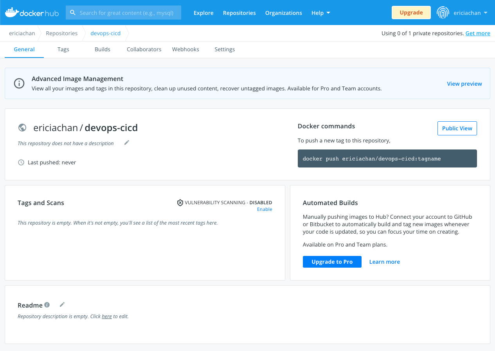
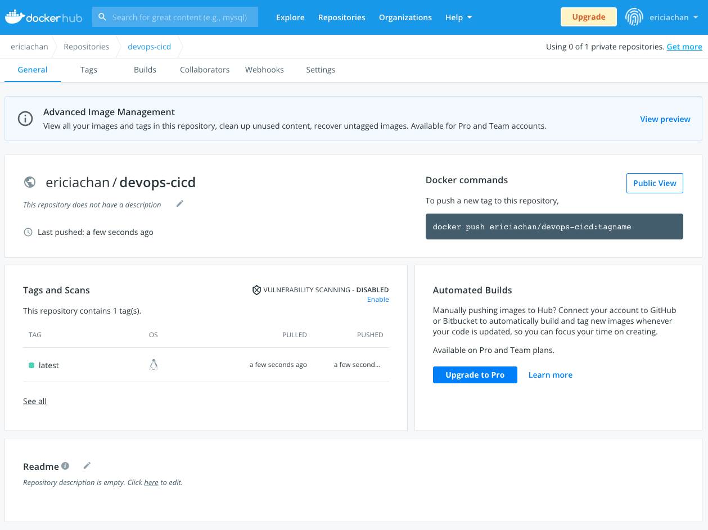
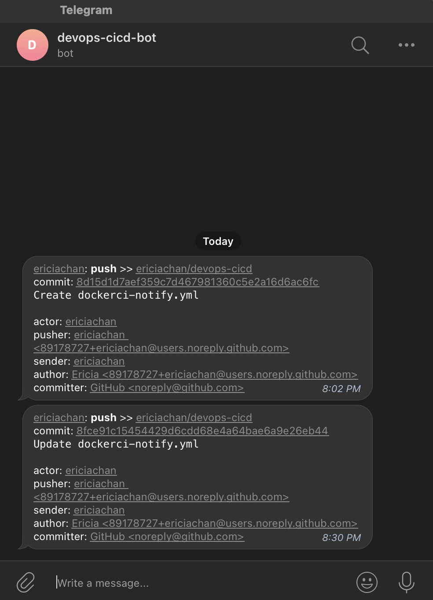

<h1 align="center">DevOps CI/CD using Github Actions</h1>

# Overview  

The [Docker CI and Telegram Notification](https://github.com/ericiachan/devops-cicd/actions/workflows/dockerci-notify.yml) workflow automates the build and push of the Docker Image to Docker Hub, and triggers a Telegram notification with details on the change committed, which sent is through a Telegram bot (@devops-cicd-bot). 
 
 
## Part I: Initialize a Repository 
Begin by initializing an empty repository and uploading the necessary files to the respository. 
 
 
## Part II: Build and Push Docker Image 
The first part of the workflow focuses on building and pushing the Docker Image to a repository in Docker Hub. Each time a Github Event (Push/Pull) is committed, the workflow will be triggered and the aforementioned action will take place. 

The following parameters are required:

| Key                    | Input                                    | 
| ---------------------- |------------------------------------------| 
| <b>`username`</b>      | Docker username                          | 
| <b>`password`</b>      | Docker account password or access token  |
| <b>`tags`</b>          | Name of Docker repository                | 

###### <i>Important Note: [Github Secrets](https://docs.github.com/en/actions/security-guides/encrypted-secrets) is key to this workflow.</i>  

Once the workflow has been executed successfully, changes to the Docker Hub repository should be reflected.

**_Before workflow execution:_**

**_After workflow execution:_**

 
 
## Part III: Exploring Github Marketplace
The [Marketplace](https://github.com/marketplace) is a pandora's box filled with plenty of interesting features. For this project, the intention was to include a notification action in the workflow that alerts the user on changes made with each iteration of workflow executed.

Of the numerous options to select from, a Telegram notification action was the eventual choice. 
 
 
## Part IV: Sending a Notification 
Building on the existing first half of the workflow, the second half incorporates a Telegram notification action in the workflow. Upon the Github Event trigger, a Telegram notification is sent to user to notify them on the commit made. 

The following are details included in the Telegram notification:
  * Github event type (E.g. Push, Pull, etc)
  * ID of the commit made
  * Description of the commit made
  * User who triggered the event and made the commit

To incorporate this action in the workflow, there are a number of hoops to go through:  
1. Create a Telegram Bot by speaking to the [BotFather](https://t.me/botfather). 
2. Take note of the chat_id and token for the newly created Bot.
3. Update the workflow .yml file to incorporate this Telegram notification feature. The Telegram Bot credentials are essential for this. 
4. Commit changes and await the notification from your Bot.

The following parameters are required:

| Key         | Input                | 
| ------------|----------------------| 
| token       | Telegram Bot token   |
| to          | Telegram Bot chat_id |

**_Telegram Notification:_** 
 

